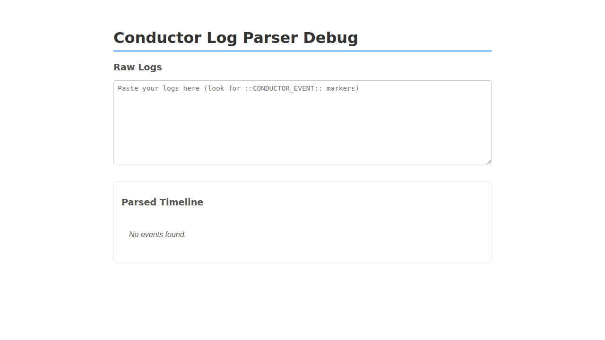
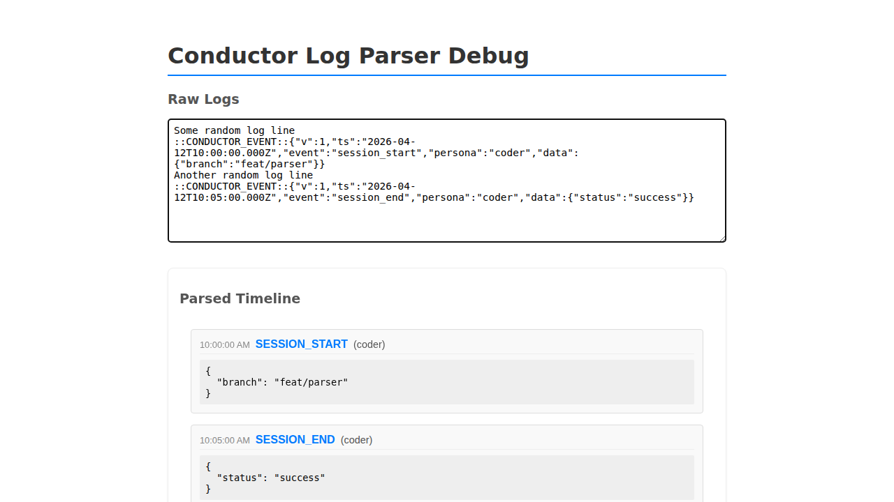

# Observability Log Parser Debug Page

Verify that the log parser correctly extracts and displays events.

## User navigates to the debug page

### Verifications
- [x] Heading is visible
- [x] Textarea is visible

---

## User pastes sample logs

### Verifications
- [x] Two event cards are rendered
- [x] session_start event is visible
- [x] session_end event is visible

---

