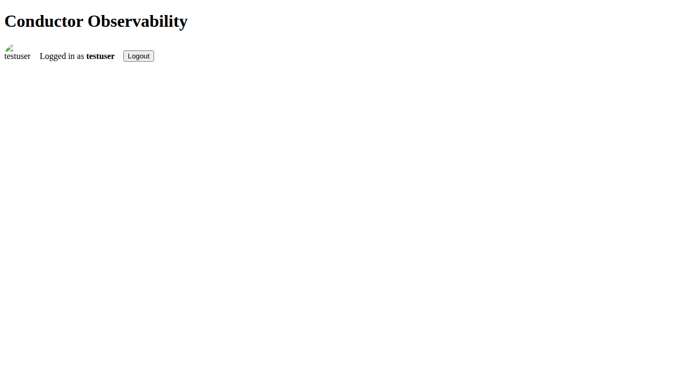

# GitHub OAuth Flow

Verify that a user can login via GitHub and see their profile.

## Landing page loaded with Login button

### Verifications
- [x] Login button is visible
- [x] Title is correct

---

## User is logged in and profile is displayed

### Verifications
- [x] Username is visible
- [x] Avatar is visible
- [x] Logout button is visible

---

## User is logged out and login button is visible again

### Verifications
- [x] Login button is visible
- [x] Username is not visible

---

