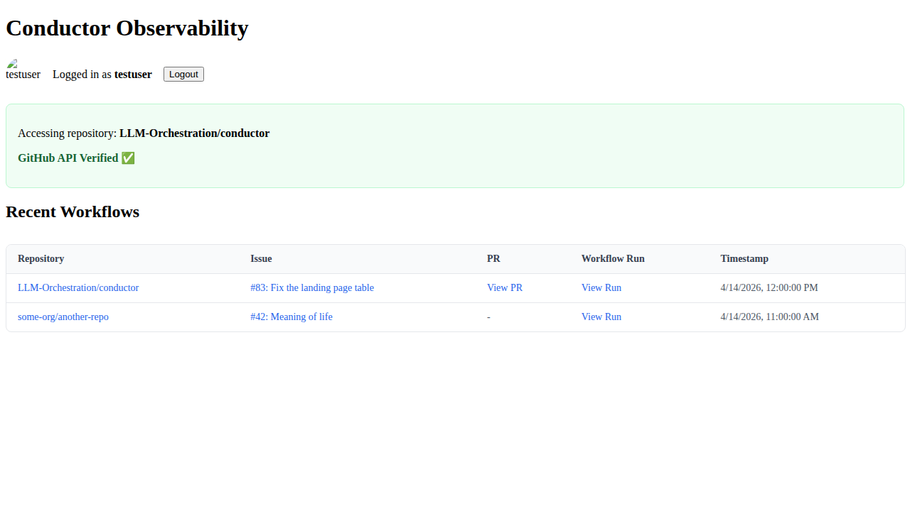

# Workflow Table Display

Verify that the landing page shows a table of recent workflow runs when logged in.

## Landing page loaded with Login button

### Verifications
- [x] Login button is visible

---

## Workflow table is displayed with correct data

### Verifications
- [x] Table headers are correct
- [x] First row data is correct (with PR)
- [x] Second row data is correct (without PR)

---

