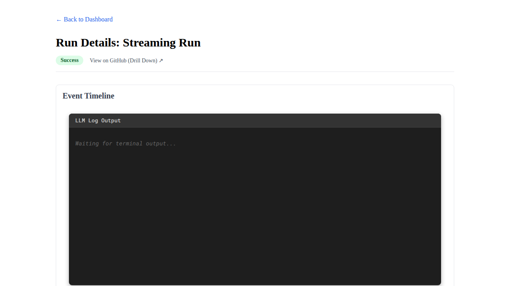

# Run Details Streaming Logs

Verify that the run details route polls for logs and updates the timeline.

## Initially shows steps when logs are 404

### Verifications
- [x] Fallback steps are visible
- [x] Live indicator is visible
- [x] Waiting message is visible

---

## Timeline updates when partial logs are available

### Verifications
- [x] Session start event is visible

---

## Timeline updates when logs are complete and polling stops

### Verifications
- [x] Session end event is visible
- [x] Live indicator disappears after completion

---

