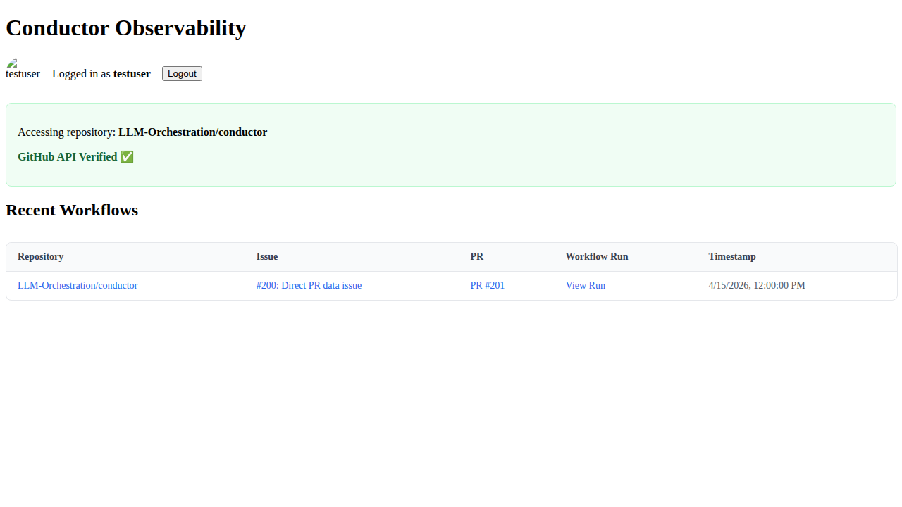

# PR Lookup by Workflow Run Data

Verify that the PR is correctly identified using the pull_requests field already present in the workflow run object.

## PR link is visible based on the direct pull_requests data in the workflow run

### Verifications
- [x] PR link points to the correct PR found via direct data

---

