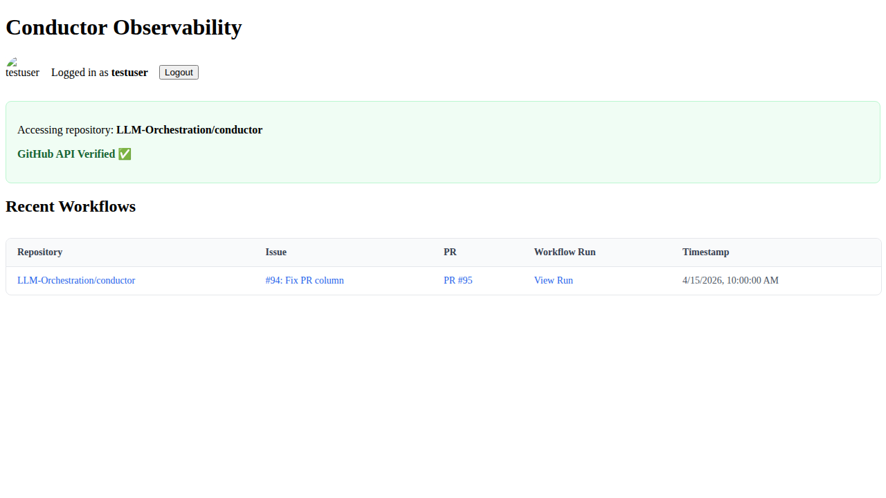

# PR Lookup by Branch Label

Verify that the PR is correctly identified using the branch: label on the issue.

## PR link is visible based on the branch: label

### Verifications
- [x] PR link points to the correct PR found via branch label

---

