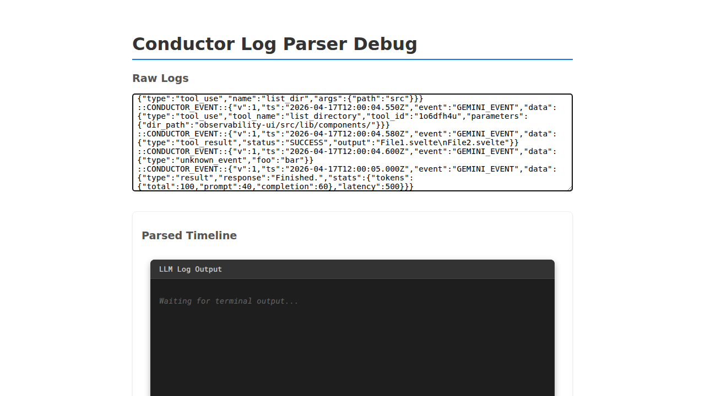

# Gemini JSON Mode Observability

Verify that Gemini JSON events are correctly aggregated and rendered.

## User navigates to the debug page

### Verifications
- [x] Heading is visible

---

## User pastes Gemini JSON logs

### Verifications
- [x] Gemini Initialized is visible
- [x] Assistant message is aggregated
- [x] Tool use is visible
- [x] Tool use with name field is visible
- [x] Tool use with new field names is visible
- [x] Unknown event is visible
- [x] Tool result is visible
- [x] Tool result with data and status is visible
- [x] Tool result with status as name is visible
- [x] Copy button is visible in JsonTree
- [x] Final result is visible with stats

---

