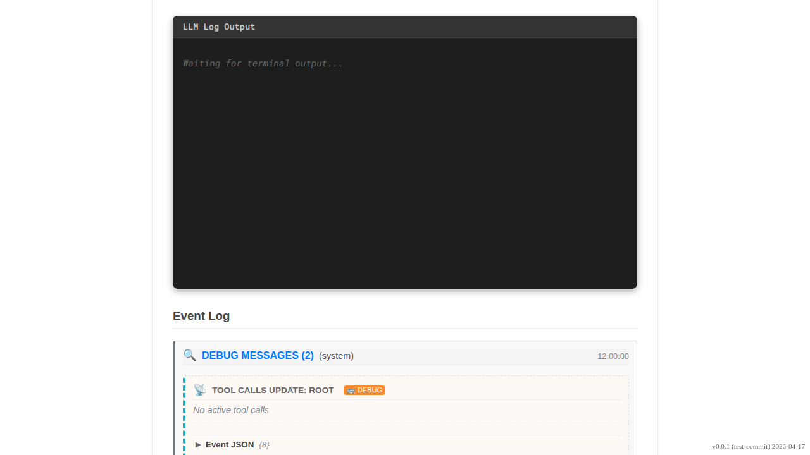

# Gemini Message Bus Events

Verify that Message Bus events are correctly rendered as debug cards.

## User pastes Message Bus events

### Verifications
- [x] Events are grouped
- [x] Expanding group shows both events
- [x] Empty tool calls shows status
- [x] Active tool call shows function name

---

