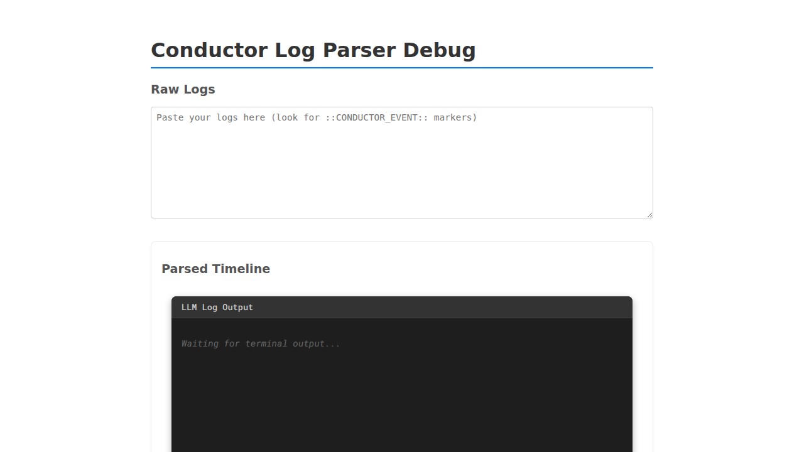
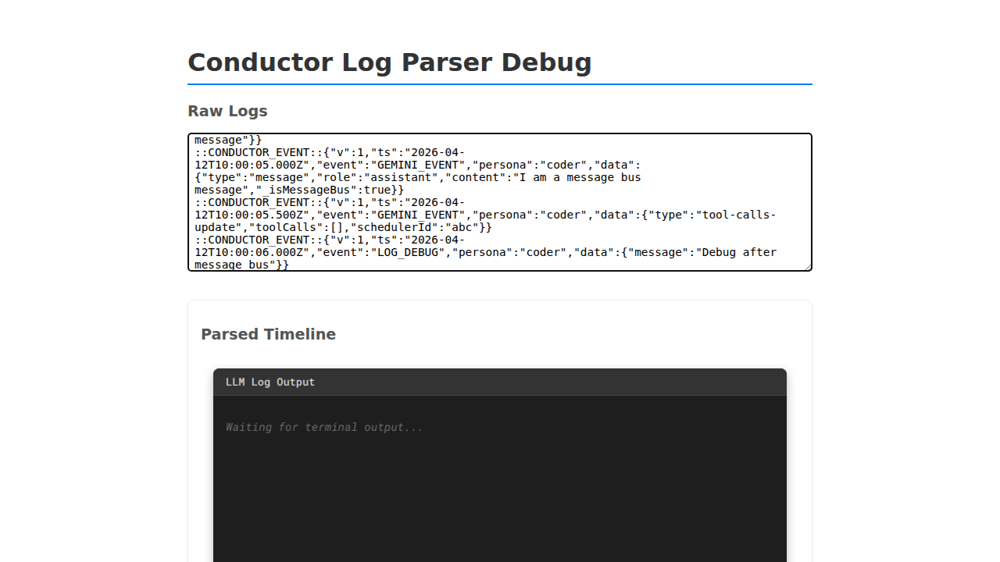
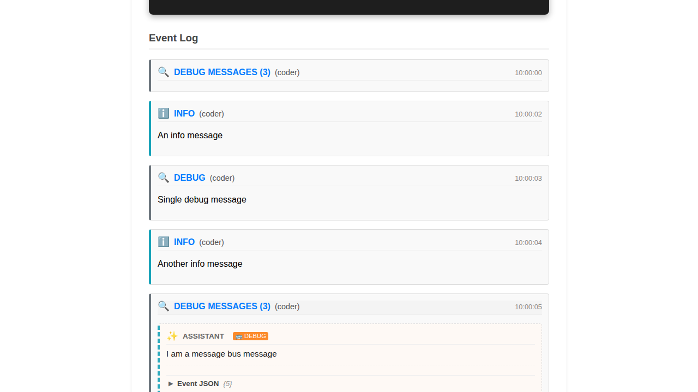

# Observability Debug Message Grouping

Verify that consecutive debug messages are grouped into a collapsed card.

## User navigates to the debug page

### Verifications

---

## Consecutive debug messages are grouped

### Verifications
- [x] Two debug groups, two info messages, and one single debug message are visible
- [x] Single debug message is visible
- [x] First group shows (3) and is collapsed
- [x] Second group shows (3) and contains Gemini event

---

## User expands a debug group

### Verifications
- [x] Group is now expanded and Gemini message is visible

---

