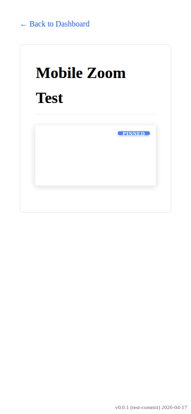
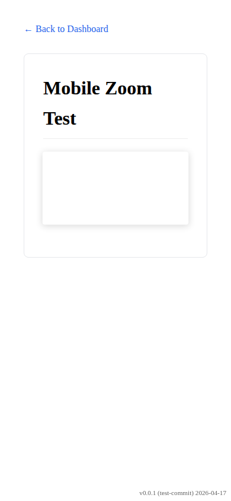

# Mobile Zoom Lens Magnifier

Verify that images in documentation pages are enhanced with the zoom lens magnifier and support touch interactions.

## Tapping pins the magnifier on mobile

### Verifications
- [x] Magnifier container exists
- [x] Canvas exists and is loaded
- [x] Pin indicator is initially hidden
- [x] Tapping shows pin indicator

---

## Tapping again unpins and dismisses the magnifier on mobile

### Verifications
- [x] Tapping again hides pin indicator

---

