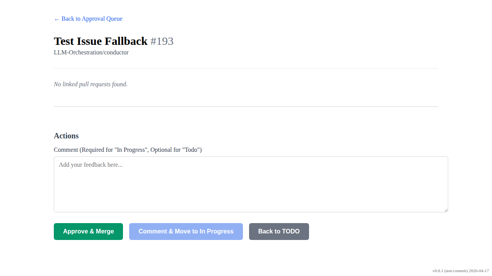

# Approval Queue Fallback

Verify the fallback search for project item ID if missing from URL and issue.

## Approval detail page loaded and fallback item ID found

### Verifications
- [x] Issue title is visible

---

## Action using fallback item ID successful

### Verifications
- [x] Redirected back to /approval

---

