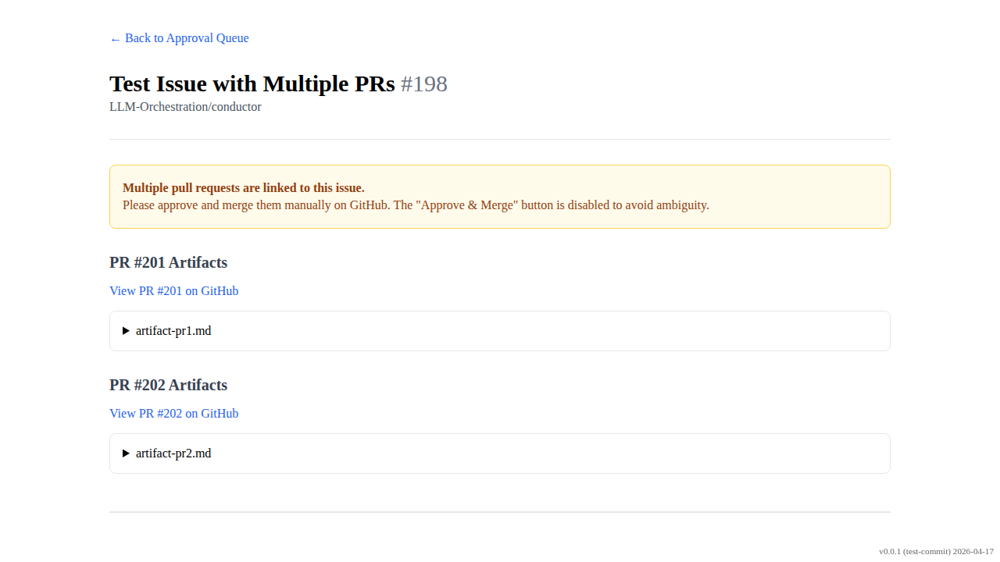
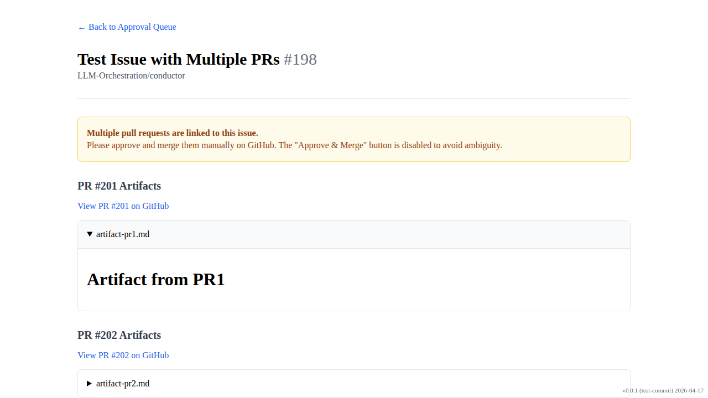
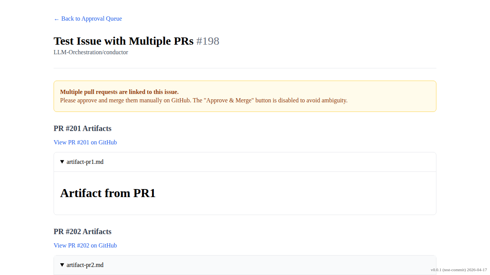

# Multiple PRs Approval Detail

Verify that the approvals UI correctly handles multiple linked PRs by showing artifacts from all PRs and hiding the approve button.

## Approval detail page shows artifacts from multiple PRs and warning message

### Verifications
- [x] Warning message is visible
- [x] Artifact from PR1 is visible
- [x] Artifact from PR2 is visible
- [x] Approve & Merge button is NOT visible
- [x] Other action buttons are still visible

---

## Artifact from PR1 can be expanded to view content

### Verifications
- [x] Rendered markdown content from PR1 is visible

---

## Artifact from PR2 can be expanded to view content

### Verifications
- [x] Rendered markdown content from PR2 is visible

---

