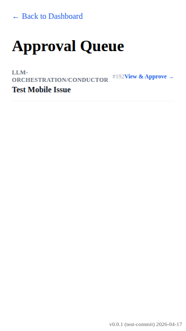
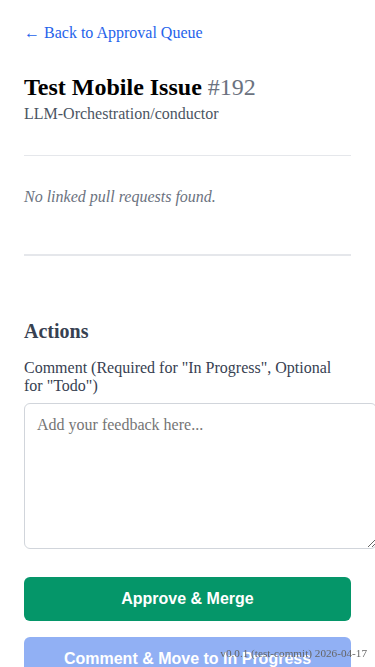
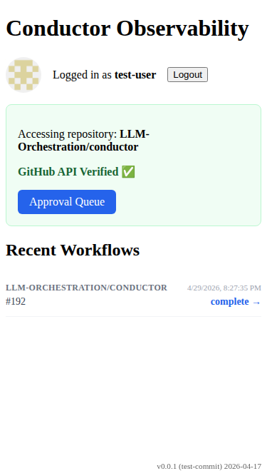

# Approval Queue Mobile View

Verify the approval queue mobile-specific layout and responsiveness.

## Approval queue shows mobile list layout and hides desktop table

### Verifications
- [x] Mobile view container is visible
- [x] Desktop view container is hidden
- [x] List item is visible
- [x] Issue number is visible in item
- [x] Repo name is visible in item
- [x] Title is visible in item
- [x] Mobile action hint is visible

---

## Approval detail page adjusts for mobile screen

### Verifications
- [x] Detail page heading is visible
- [x] Button group stacks vertically
- [x] Action buttons are full-width

---

## Workflow table displays as a list on mobile

### Verifications
- [x] Workflow mobile view is visible
- [x] Workflow desktop view is hidden
- [x] Repo tag is visible
- [x] Status link is visible
- [x] No horizontal scrolling in workflow container

---

